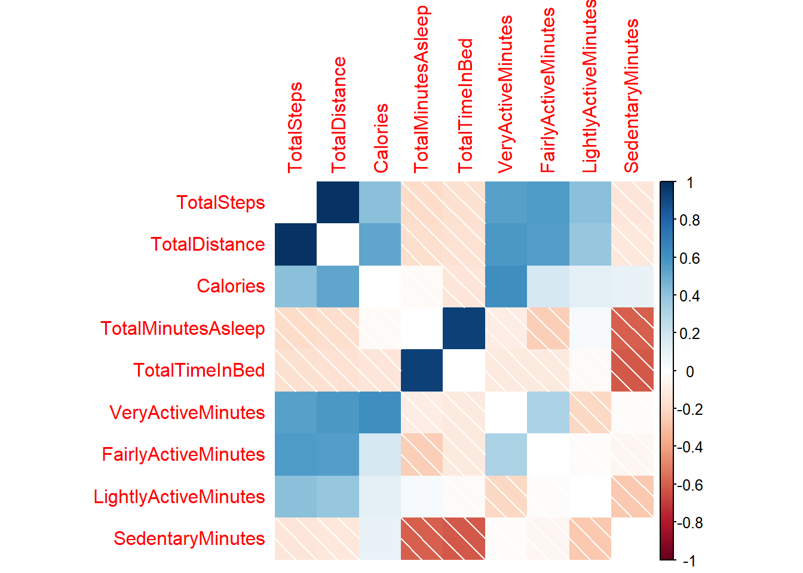

Study Case - Bellabet Product Analysis
================

## Introduction

Bellabeat is a small company that have the potential to become a bigger
player in smart health device market. Urska Srsen as co-founder believes
that analyzing data more smart devices can unlock new growth by gaining
insight into how consumers use smart devices.The insight will help
marketing departement.

## Phase 1: Ask

To help Bellabeat, data analyst will find trends of how customers use
non Bellabeat smart devices then apply those insights to Bellabeat
product. This process also will tell how can this trends insight help
Bellabeat marketing strategy.

**Key Objective**: Finding user trend pattern of smart device usage.

## Phase 2: Prepare

To analyze this problem, we will need non Bellabeat smart device user
usage. In this case we will use [FitBit Smart Device
Data.](https://www.kaggle.com/datasets/arashnic/fitbit)

**The Credibility and Privacy of The Data**: This dataset generated by
respondents to a distributed survey via Amazon Mechanical Turk between
03.12.2016-05.12.2016. Thirty eligible Fitbit users consented to the
submission of personal tracker data, including minute-level output for
physical activity, heart rate, and sleep monitoring.

**Sort and Filter**: In this case, we will not use all of the data, but
we will only find insights from sleep and activity data.

``` r
daily_step <- read.csv("dailySteps_merged.csv")
daily_sleep <- read.csv("sleepDay_merged.csv")
daily_act <- read.csv("dailyActivity_merged.csv")
```

## Phase 3: Process

**Tools needed**: In this phase, we will determine and install libraries
that will be used.

``` r
library(tidyverse)
```

    ## ── Attaching packages ─────────────────────────────────────── tidyverse 1.3.2 ──
    ## ✔ ggplot2 3.3.6      ✔ purrr   0.3.4 
    ## ✔ tibble  3.1.8      ✔ dplyr   1.0.10
    ## ✔ tidyr   1.2.1      ✔ stringr 1.4.1 
    ## ✔ readr   2.1.2      ✔ forcats 0.5.2 
    ## ── Conflicts ────────────────────────────────────────── tidyverse_conflicts() ──
    ## ✖ dplyr::filter() masks stats::filter()
    ## ✖ dplyr::lag()    masks stats::lag()

**Data Preview and Cleansing:**

``` r
str(daily_act)
```

    ## 'data.frame':    940 obs. of  15 variables:
    ##  $ Id                      : num  1.5e+09 1.5e+09 1.5e+09 1.5e+09 1.5e+09 ...
    ##  $ ActivityDate            : chr  "4/12/2016" "4/13/2016" "4/14/2016" "4/15/2016" ...
    ##  $ TotalSteps              : int  13162 10735 10460 9762 12669 9705 13019 15506 10544 9819 ...
    ##  $ TotalDistance           : num  8.5 6.97 6.74 6.28 8.16 ...
    ##  $ TrackerDistance         : num  8.5 6.97 6.74 6.28 8.16 ...
    ##  $ LoggedActivitiesDistance: num  0 0 0 0 0 0 0 0 0 0 ...
    ##  $ VeryActiveDistance      : num  1.88 1.57 2.44 2.14 2.71 ...
    ##  $ ModeratelyActiveDistance: num  0.55 0.69 0.4 1.26 0.41 ...
    ##  $ LightActiveDistance     : num  6.06 4.71 3.91 2.83 5.04 ...
    ##  $ SedentaryActiveDistance : num  0 0 0 0 0 0 0 0 0 0 ...
    ##  $ VeryActiveMinutes       : int  25 21 30 29 36 38 42 50 28 19 ...
    ##  $ FairlyActiveMinutes     : int  13 19 11 34 10 20 16 31 12 8 ...
    ##  $ LightlyActiveMinutes    : int  328 217 181 209 221 164 233 264 205 211 ...
    ##  $ SedentaryMinutes        : int  728 776 1218 726 773 539 1149 775 818 838 ...
    ##  $ Calories                : int  1985 1797 1776 1745 1863 1728 1921 2035 1786 1775 ...

``` r
str(daily_sleep)
```

    ## 'data.frame':    413 obs. of  5 variables:
    ##  $ Id                : num  1.5e+09 1.5e+09 1.5e+09 1.5e+09 1.5e+09 ...
    ##  $ SleepDay          : chr  "4/12/2016 12:00:00 AM" "4/13/2016 12:00:00 AM" "4/15/2016 12:00:00 AM" "4/16/2016 12:00:00 AM" ...
    ##  $ TotalSleepRecords : int  1 2 1 2 1 1 1 1 1 1 ...
    ##  $ TotalMinutesAsleep: int  327 384 412 340 700 304 360 325 361 430 ...
    ##  $ TotalTimeInBed    : int  346 407 442 367 712 320 377 364 384 449 ...

``` r
str(daily_step)
```

    ## 'data.frame':    940 obs. of  3 variables:
    ##  $ Id         : num  1.5e+09 1.5e+09 1.5e+09 1.5e+09 1.5e+09 ...
    ##  $ ActivityDay: chr  "4/12/2016" "4/13/2016" "4/14/2016" "4/15/2016" ...
    ##  $ StepTotal  : int  13162 10735 10460 9762 12669 9705 13019 15506 10544 9819 ...

Here at data preview, we find out that *data_act* actually contains a
lot of data like TotalSteps, Activities and so on. We don’t really need
the other. We only need to merge the missing data like sleep time.

Before doing the merge, we will check if the data has structural errors
like columns that need to be renamed, missing values and wrong data
types.

``` r
head(daily_act)
```

    ##           Id ActivityDate TotalSteps TotalDistance TrackerDistance
    ## 1 1503960366    4/12/2016      13162          8.50            8.50
    ## 2 1503960366    4/13/2016      10735          6.97            6.97
    ## 3 1503960366    4/14/2016      10460          6.74            6.74
    ## 4 1503960366    4/15/2016       9762          6.28            6.28
    ## 5 1503960366    4/16/2016      12669          8.16            8.16
    ## 6 1503960366    4/17/2016       9705          6.48            6.48
    ##   LoggedActivitiesDistance VeryActiveDistance ModeratelyActiveDistance
    ## 1                        0               1.88                     0.55
    ## 2                        0               1.57                     0.69
    ## 3                        0               2.44                     0.40
    ## 4                        0               2.14                     1.26
    ## 5                        0               2.71                     0.41
    ## 6                        0               3.19                     0.78
    ##   LightActiveDistance SedentaryActiveDistance VeryActiveMinutes
    ## 1                6.06                       0                25
    ## 2                4.71                       0                21
    ## 3                3.91                       0                30
    ## 4                2.83                       0                29
    ## 5                5.04                       0                36
    ## 6                2.51                       0                38
    ##   FairlyActiveMinutes LightlyActiveMinutes SedentaryMinutes Calories
    ## 1                  13                  328              728     1985
    ## 2                  19                  217              776     1797
    ## 3                  11                  181             1218     1776
    ## 4                  34                  209              726     1745
    ## 5                  10                  221              773     1863
    ## 6                  20                  164              539     1728

``` r
head(daily_sleep)
```

    ##           Id              SleepDay TotalSleepRecords TotalMinutesAsleep
    ## 1 1503960366 4/12/2016 12:00:00 AM                 1                327
    ## 2 1503960366 4/13/2016 12:00:00 AM                 2                384
    ## 3 1503960366 4/15/2016 12:00:00 AM                 1                412
    ## 4 1503960366 4/16/2016 12:00:00 AM                 2                340
    ## 5 1503960366 4/17/2016 12:00:00 AM                 1                700
    ## 6 1503960366 4/19/2016 12:00:00 AM                 1                304
    ##   TotalTimeInBed
    ## 1            346
    ## 2            407
    ## 3            442
    ## 4            367
    ## 5            712
    ## 6            320

Based on the data preview, we see that the column names are normal, so
we do not need to change their names.

To get more understanding about the data, we will check how many unique
user that input their data.

``` r
n_distinct(daily_act$Id)
```

    ## [1] 33

``` r
n_distinct(daily_sleep$Id)
```

    ## [1] 24

Those distinct values show us that there are 33 unique user who
participate the survey. The 24 unique value from sleep data might
indicate that there were some people who did not input their sleep data.
We will fix it at merge process later.

The next step is finding missing values.

``` r
sum(is.na(daily_act))
```

    ## [1] 0

``` r
sum(is.na(daily_sleep))
```

    ## [1] 0

**Data Transformation**

We also find that there is data type difference between SleepDay (sleep
data) and ActivityDate (daily activity data). So we need to make the
same format for date data type, in this case we will use MM/DD/YYYY

``` r
head(daily_sleep$SleepDay)
```

    ## [1] "4/12/2016 12:00:00 AM" "4/13/2016 12:00:00 AM" "4/15/2016 12:00:00 AM"
    ## [4] "4/16/2016 12:00:00 AM" "4/17/2016 12:00:00 AM" "4/19/2016 12:00:00 AM"

``` r
head(daily_act$ActivityDate)
```

    ## [1] "4/12/2016" "4/13/2016" "4/14/2016" "4/15/2016" "4/16/2016" "4/17/2016"

``` r
daily_sleep$SleepDay <- as.Date(daily_sleep$SleepDay, format = "%m/%d/%Y")
head(daily_sleep$SleepDay)
```

    ## [1] "2016-04-12" "2016-04-13" "2016-04-15" "2016-04-16" "2016-04-17"
    ## [6] "2016-04-19"

``` r
daily_act$ActivityDate <- as.Date(daily_act$ActivityDate, format = "%m/%d/%Y")
head(daily_act$ActivityDate)
```

    ## [1] "2016-04-12" "2016-04-13" "2016-04-14" "2016-04-15" "2016-04-16"
    ## [6] "2016-04-17"

``` r
str(daily_sleep$SleepDay)
```

    ##  Date[1:413], format: "2016-04-12" "2016-04-13" "2016-04-15" "2016-04-16" "2016-04-17" ...

``` r
str(daily_act$ActivityDate)
```

    ##  Date[1:940], format: "2016-04-12" "2016-04-13" "2016-04-14" "2016-04-15" "2016-04-16" ...

## **Phase 4: Analyzing**

The next step is to merge data so we can analyze it more easier and
effective.

``` r
daily_act <- rename(daily_act, "date"= "ActivityDate")
daily_sleep <- rename(daily_sleep, "date"= "SleepDay")
```

``` r
data <- merge(x = daily_act, y = daily_sleep, by=c("Id", "date"))
```

``` r
data_without_id <- data %>% select(TotalSteps, TotalDistance, Calories, TotalMinutesAsleep, TotalTimeInBed, VeryActiveMinutes, FairlyActiveMinutes, LightlyActiveMinutes, SedentaryMinutes)
head(data)
```

    ##           Id       date TotalSteps TotalDistance TrackerDistance
    ## 1 1503960366 2016-04-12      13162          8.50            8.50
    ## 2 1503960366 2016-04-13      10735          6.97            6.97
    ## 3 1503960366 2016-04-15       9762          6.28            6.28
    ## 4 1503960366 2016-04-16      12669          8.16            8.16
    ## 5 1503960366 2016-04-17       9705          6.48            6.48
    ## 6 1503960366 2016-04-19      15506          9.88            9.88
    ##   LoggedActivitiesDistance VeryActiveDistance ModeratelyActiveDistance
    ## 1                        0               1.88                     0.55
    ## 2                        0               1.57                     0.69
    ## 3                        0               2.14                     1.26
    ## 4                        0               2.71                     0.41
    ## 5                        0               3.19                     0.78
    ## 6                        0               3.53                     1.32
    ##   LightActiveDistance SedentaryActiveDistance VeryActiveMinutes
    ## 1                6.06                       0                25
    ## 2                4.71                       0                21
    ## 3                2.83                       0                29
    ## 4                5.04                       0                36
    ## 5                2.51                       0                38
    ## 6                5.03                       0                50
    ##   FairlyActiveMinutes LightlyActiveMinutes SedentaryMinutes Calories
    ## 1                  13                  328              728     1985
    ## 2                  19                  217              776     1797
    ## 3                  34                  209              726     1745
    ## 4                  10                  221              773     1863
    ## 5                  20                  164              539     1728
    ## 6                  31                  264              775     2035
    ##   TotalSleepRecords TotalMinutesAsleep TotalTimeInBed
    ## 1                 1                327            346
    ## 2                 2                384            407
    ## 3                 1                412            442
    ## 4                 2                340            367
    ## 5                 1                700            712
    ## 6                 1                304            320

``` r
str(data_without_id)
```

    ## 'data.frame':    413 obs. of  9 variables:
    ##  $ TotalSteps          : int  13162 10735 9762 12669 9705 15506 10544 9819 14371 10039 ...
    ##  $ TotalDistance       : num  8.5 6.97 6.28 8.16 6.48 ...
    ##  $ Calories            : int  1985 1797 1745 1863 1728 2035 1786 1775 1949 1788 ...
    ##  $ TotalMinutesAsleep  : int  327 384 412 340 700 304 360 325 361 430 ...
    ##  $ TotalTimeInBed      : int  346 407 442 367 712 320 377 364 384 449 ...
    ##  $ VeryActiveMinutes   : int  25 21 29 36 38 50 28 19 41 39 ...
    ##  $ FairlyActiveMinutes : int  13 19 34 10 20 31 12 8 21 5 ...
    ##  $ LightlyActiveMinutes: int  328 217 209 221 164 264 205 211 262 238 ...
    ##  $ SedentaryMinutes    : int  728 776 726 773 539 775 818 838 732 709 ...

To gain more insights for each variables correlation, we will need a
correlation visualization.

``` r
library(corrplot)
```

    ## corrplot 0.92 loaded

``` r
M = cor(data_without_id)
corrplot(M, method = 'shade', diag = FALSE)   
```

<!-- -->

Based on the correlation visual, we see that there are some data that
have correlation. Here is what we will focus on:

- SedentaryMinutes vs TotalMinutesAsleep

- Calories Burned vs TotalSteps

We also want to see:

- The difference between bed time and sleep time

- Calories Burned distribution per Activity Types

**Making Visualization**

``` r
library(ggplot2)

ggplot(data, aes(x=SedentaryMinutes, y=TotalMinutesAsleep)) +
  geom_point() +
  stat_smooth(method=loess) +
  theme_minimal() + 
  labs(title="Correlation Between Sleep Minutes and Sedentary Minutes") +
  # move the title text to the middle
  theme(plot.title=element_text(hjust=0.5))
```

    ## `geom_smooth()` using formula 'y ~ x'

<!-- -->

Based on the viz, we see that there is correlation between sleep minutes
and sedentary activity minutes. In this case, the more user got
sedentary activities in minutes, the less they sleep. The less sleep
might indicate bad sleep for user because based on Sleep Foundation
Organization, adults need to sleep 7-9 hours or 420 - 540 minutes.
[Sleep Foundation
Recommendation](https://www.sleepfoundation.org/how-sleep-works/how-much-sleep-do-we-really-need)

``` r
ggplot(data, aes(x = Calories, y = TotalSteps)) +geom_point() +
  stat_smooth(method=loess) +
  theme_minimal() + 
  labs(title="Correlation Between Calories Burned and Steps") +
  # move the title text to the middle
  theme(plot.title=element_text(hjust=0.5))
```

    ## `geom_smooth()` using formula 'y ~ x'

<!-- -->

Based on the viz, we see that the more steps user did, the more calories
burned. This is correct because every step human do needs calories to
burn
[(Source)](https://www.healthhub.sg/live-healthy/1523/power-hawker-diet-to-match-your-10000-steps).
In the fitness industry, calories usually correlate with weight loss, so
Bellabeat can notify user to do more steps if they got weight loss goal.

``` r
library(dplyr)
sleep_data <- data %>% select(TotalMinutesAsleep, TotalTimeInBed)
sleep_data <- mutate(sleep_data, MinutesDiff = TotalTimeInBed - TotalMinutesAsleep)
head(sleep_data)
```

    ##   TotalMinutesAsleep TotalTimeInBed MinutesDiff
    ## 1                327            346          19
    ## 2                384            407          23
    ## 3                412            442          30
    ## 4                340            367          27
    ## 5                700            712          12
    ## 6                304            320          16

``` r
print(paste("Average Different Times Between In Bed and Asleep =", round(mean(sleep_data$MinutesDiff)), "minutes"))
```

    ## [1] "Average Different Times Between In Bed and Asleep = 39 minutes"

Average time user spends time In Bed without Asleep is 39 minutes. This
data indicates that Time In Bed is not the same as Time A Sleep. User
need to know this so they can reorganize their “sleep” schedule.

``` r
#We will try to categorize data based on  steps. We will count based on: <5k steps, 5k-10k and >10k

data %>% 
  summarise(
    steps_category = factor(case_when
                            (
                              TotalSteps < 5000 ~ "less than 5k steps",
                              TotalSteps >= 5000 & TotalSteps <= 10000 ~ "5k-10k steps",
                              TotalSteps > 10000 ~ "more than 10k steps"
                            ), levels = c("more than 10k steps", "5k-10k steps", "less than 5k steps")), Id 
) %>%
  ggplot(aes(steps_category, , fill = steps_category)) +
  geom_bar() +
  labs(title = "Data Input Based On Step Distribution") +
  theme(plot.title=element_text(hjust=0.5))
```

<!-- -->

Based on the data we receive, we see that people actually did \> 10k
steps more than the sedentary steps (\<5k steps). With this data, we can
motivate user to do more steps.

## Phase 5: Share and Act

From the analysis and visualization above, data analyst can recommend
some ideas for marketing strategy. Here is the recommendation:

- Bellabeat can make a content that tells user that Time In Bed is
  different with Time Asleep. Bellabeat can pursue user to use Bellabeat
  smart device to remind and organize the sleep schedule so user can get
  a good sleep (7-9 hours).

- Bellabeat users need to know that a good quality sleep is depends on
  their activities. Data shows that the more sedentary minutes the less
  sleep they got. Bellabeat can give them reminder to do some
  activities.

- User that has a weight lose goal and use the calories burned as their
  metric can be benefited. There is strong correlation between step
  count and calories burned. User can be notified to do more step so
  they can burn more calories.

- Based on Fitbit data, we see that people actually did \> 10k steps.
  This data can be a valuable content for Marketing Team to motivate
  users to do more steps and tells them that 10k steps can be done.
  Users need to do more steps because research done by The George
  Institute for Global Health back in 2015 suggest that upping daily
  step count to 10,000 could have a huge impact on health.

## Final: Thank You!

Thank you for your time to read this analysis. Hope this notebook can
help you gain more understanding about R Programming and basic data
analysis.

This is my first project with R. Suggestion, critics and recommendation
are welcome.


